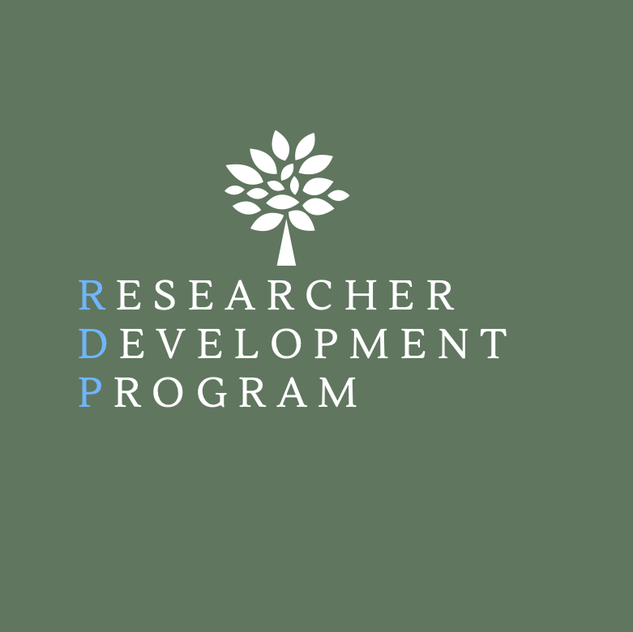

--- 
title: 'Researcher Development Program Mentors'
output:
    tufte::tufte_html
--- 
```{r set_knitr_chunk_options, echo=FALSE, message=FALSE}
#set global output chunk options
knitr::opts_chunk$set(echo=FALSE, message=FALSE, warning=FALSE, collapse = F, highlight = F, results = "asis")
```

```{r}
library(tidyverse)
library(ggrepel)
library(kableExtra)
library(janitor)
library(leaflet)
library(readxl)
```

```{r}
#import data 
mentor20 <- read_csv("2020_RDP_Mentors.csv")
mentor21 <- read_csv("2021_RDP_Mentors.csv")
geocode <- read_xlsx("College_Geocodes.xlsx")
```

```{r}
# Get the unique institutions 
institutions <- union(mentor20, mentor21)

#Made another dataset with more rdp mentor intstitions 
rdp <- read_xlsx("RDP_institutions.xlsx")
```

```{r}
#Only get names in the geocodes data that are in the institutions data set
df <- geocode %>% 
  filter(NAME %in% rdp$Institution)

#match rdp colleges by unitid column 
df <-geocode %>% 
  filter(UNITID %in% rdp$UNITID)

# See if there are any rows missing
#anti_join(rdp, df, by = c("Institution" = "NAME"))
```

{#id .class width=300 height=360px}
---

# About The Researcher Development Program 
The Researcher Development Program (RDP) is a joint initiative between the UCEA Graduate Student Council (GSC) and the AERA Leadership for School Improvement Special Interest Group (LSI SIG). RDP is aimed at providing graduate students and faculty members at different institutions with opportunities to form research-focused collaborations. Graduate students benefit from the expertise of their faculty mentor and receive feedback throughout the course of project development. Faculty members benefit from collaboration with emerging scholars who share their research interests. The program is unique in its focus on establishing ongoing mentor-mentee relationships through the development of a research product which could include, but is not limited to, conference proposals or presentations, posters, policy briefs, and papers.

**Current RDP Program Committee**

- 2020 Student Representatives: Parker Morse Andreoli, Briana Bostic, Mariama Nagbe, Lamar Foster, and Frank Gause 
- 2019 Student Representatives: Lamar Foster, Parker Morse Andreoli, Mariama Nagbe
- 2018 Student Representatives: Alison Wilson, Lam Pham, Tamilah Richardson, Bryan V anGronigen
- Faculty Advisors: Stephen Kotok (2020-2022), Jennifer Clayton (2019-2021), Angela Urick (2018-2020)

---
# RDP Mentors

RDP is thankful for the many mentors who have spent countless hours pouring into graduate students. Our mentors help guide and teach RDP mentees the ins and outs of research methods. Many of our mentors come from across the United States and beyond. 

This map shows some of the locations of current and former RDP mentors. If you hover over the markers, you will see which institution our mentors represent. 
```{r}
df %>% 
leaflet() %>%
addProviderTiles(providers$Esri.WorldImagery, group = "World Imagery") %>%
addProviderTiles(providers$CartoDB.Positron, group = "Carto") %>% 
addProviderTiles(providers$Stamen.TonerLite, group = "Toner Lite") %>%
addLayersControl(baseGroups = c("Toner Lite", "Carto", "World Imagery")) %>%
addMarkers(label = df$NAME)

```


